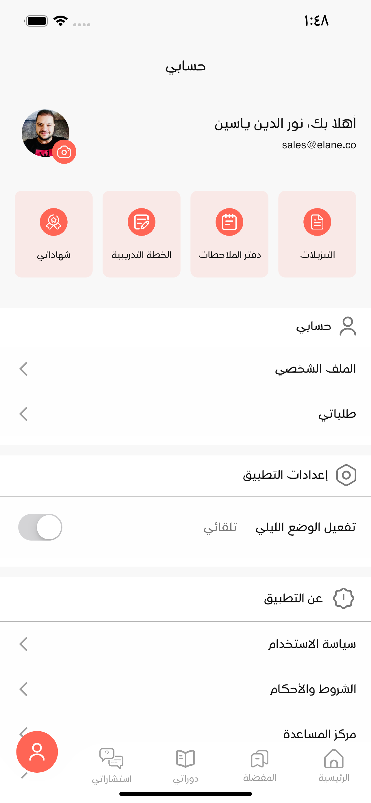

# Emastery Academy Project

## Developer Information
- **Developer Name:** Omar Nasser
- **Email:** omarnaser1997@gmail.com

## Project Overview
This is a Flutter project for ELT.

## About the App
The application is designed for the Mastery Academy platform, which is the leading Arab educational platform in distance education. The academy was established in 2017 with the aim of providing a rich educational experience for the youth of the Arab world. It uses modern scientific methods and resources in various fields, with a strong focus on management, project establishment, and entrepreneurship.

At Mastery Academy, we offer a wide range of courses on our platform to help entrepreneurs, managers, freelancers, and even employees plan their paths and master new skills. We strongly believe in the power of e-learning to empower Arab youth by providing access to high-quality education.

## Getting Started
If this is your first Flutter project, you can follow these resources to get started:
- [Lab: Write your first Flutter app](https://docs.flutter.dev/get-started/codelab)
- [Cookbook: Useful Flutter samples](https://docs.flutter.dev/cookbook)

For comprehensive guidance on Flutter development, consult the [online documentation](https://docs.flutter.dev/), which offers tutorials, samples, and a full API reference.

## Screenshots

Here are some screenshots of the YBS Flutter App:

|  |  |
| :-------------------------------------: | :-------------------------------------: |
|              *Caption 1*                |              *Caption 2*                |

|  |  |
| :-------------------------------------: | :-------------------------------------: |
|              *Caption 3*                |              *Caption 4*                |

|  |  |
|:---------------------------------------:|:---------------------------------------:|
|               *Caption 5*               |               *Caption 6*               |

|  |   |
|:---------------------------------------:|:----------------------------------------:|
|               *Caption 7*               |               *Caption 8*                |

|  |  |
|:---------------------------------------:|:----------------------------------------:|
|               *Caption 9*               |               *Caption 10*               |

|  |  |
|:----------------------------------------:|:----------------------------------------:|
|               *Caption 11*               |               *Caption 12*               |

|  |  |
|:----------------------------------------:|:----------------------------------------:|
|               *Caption 13*               |               *Caption 14*               |

|  |  |
|:----------------------------------------:|:----------------------------------------:|
|               *Caption 15*               |               *Caption 16*               |

|  |  |
|:----------------------------------------:|:----------------------------------------:|
|               *Caption 17*               |               *Caption 18*               |

|  |  |
|:----------------------------------------:|:----------------------------------------:|
|               *Caption 19*               |               *Caption 20*               |

|  |  |
|:----------------------------------------:|:----------------------------------------:|
|               *Caption 21*               |               *Caption 22*               |

|  |  |
|:----------------------------------------:|:----------------------------------------:|
|               *Caption 23*               |               *Caption 24*               |

|  |  |
|:----------------------------------------:|:----------------------------------------:|
|               *Caption 25*               |               *Caption 26*               |

|  |  |
|:----------------------------------------:|:----------------------------------------:|
|               *Caption 27*               |               *Caption 28*               |

|  |  |
|:----------------------------------------:|:----------------------------------------:|
|               *Caption 29*               |               *Caption 30*               |

|  |  |
|:----------------------------------------:|:----------------------------------------:|
|               *Caption 31*               |               *Caption 32*               |

|  |  |
|:----------------------------------------:|:----------------------------------------:|
|               *Caption 33*               |               *Caption 34*               |

|  |  |
|:----------------------------------------:|:----------------------------------------:|
|               *Caption 35*               |               *Caption 36*               |

|  |  |
|:----------------------------------------:|:----------------------------------------:|
|               *Caption 37*               |               *Caption 38*               |

|  |  |
|:----------------------------------------:|:----------------------------------------:|
|               *Caption 39*               |               *Caption 40*               |

|  |  |
|:----------------------------------------:|:----------------------------------------:|
|               *Caption 41*               |               *Caption 42*               |

|  |  |
|:----------------------------------------:|:----------------------------------------:|
|               *Caption 43*               |               *Caption 44*               |

|  |  |
|:----------------------------------------:|:----------------------------------------:|
|               *Caption 45*               |               *Caption 46*               |

|  |  |
|:----------------------------------------:|:----------------------------------------:|
|               *Caption 47*               |               *Caption 48*               |

|  |  |
|:----------------------------------------:|:----------------------------------------:|
|               *Caption 49*               |               *Caption 50*               |

|  |  |
|:----------------------------------------:|:----------------------------------------:|
|               *Caption 51*               |               *Caption 52*               |

|  |  |
|:----------------------------------------:|:----------------------------------------:|
|               *Caption 53*               |               *Caption 54*               |
